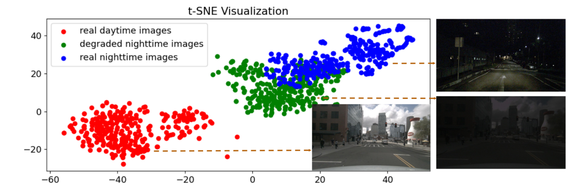

<!--
 * @Descripttion: 
 * @version: 
 * @Author: Jinlong Li CSU PhD
 * @Date: 2024-07-10 20:59:10
 * @LastEditors: Jinlong Li CSU PhD
 * @LastEditTime: 2024-08-20 14:22:25
-->


# [LightDiff](https://openaccess.thecvf.com/content/CVPR2024/papers/Li_Light_the_Night_A_Multi-Condition_Diffusion_Framework_for_Unpaired_Low-Light_CVPR_2024_paper.pdf): Light the Night: A Multi-Condition Diffusion Framework for Unpaired Low-Light Enhancement in Autonomous Driving (CVPR 2024)


[](https://arxiv.org/pdf/2404.04804)
[](./images/Supplementary_CVPR24_Light_the_Night.pdf)
<!-- []() -->


This is the official implementation of CVPR2024 paper Light the Night: A Multi-Condition Diffusion Framework for Unpaired Low-Light Enhancement in Autonomous Driving".

[Jinlong Li](https://jinlong17.github.io/)<sup>1*</sup>, [Baolu Li]()<sup>1*</sup>,[Zhengzhong Tu](https://github.com/vztu)<sup>2</sup>, [Xinyu Liu]()<sup>1</sup>, [Qing Guo]()<sup>3</sup>, [Felix Juefei-Xu]()<sup>4</sup>, [Runsheng Xu](https://derrickxunu.github.io/)<sup>5</sup>, [Hongkai Yu]()<sup>1</sup>


<sup>1</sup>Cleveland State University, <sup>2</sup>University of Texas at Austin,  <sup>3</sup>A*STAR, <sup>4</sup>New York University, <sup>5</sup>UCLA

Computer Vision and Pattern Recognition (CVPR), 2024


## [Project Page](https://genforce.github.io/freecontrol/) <br>


## Getting Started

**Environment Setup**
- We provide a [conda env file](environment.yml) for environment setup. 
```bash
conda env create -f environment.yml
conda activate lightdiff
```

- Following the installation of [BEVDepth](https://github.com/Megvii-BaseDetection/BEVDepth) step by step.

**Note:** you can first install the environment of [BEVDepth](https://github.com/Megvii-BaseDetection/BEVDepth), after you successful install it, then you can install the environment of [ControlNet](https://github.com/lllyasviel/ControlNet-v1-1-nightly).


**Model Training**

The training code is in "train.py" and the dataset code in "", which are actually surprisingly simple as follow with ControlNet. you need to set path in these python files.

```bash
python train.py
```


**Model testing**

+ **[Image enhancement]**: We have prepared a nighttime dataset from Nuscenes for low-light enhancement. Please download the [testing data](https://drive.google.com/drive/folders/1nG5j3h7b8ERXezzprt1a4dRUHS-TpMeW?usp=sharing) and the our [model checkpoint](https://csuohio-my.sharepoint.com/:u:/g/personal/2819040_vikes_csuohio_edu/EYIrVBctW3ZIu_NqC93whaABhyJgLUz2eAnd53Aw2lYKCg?e=M1TaU2). Remember to set the path in the training file accordingly. 


+ **[3D object detection]**: We utilize two 3D perception state-of-the-art methods [BEVDepth](https://github.com/Megvii-BaseDetection/BEVDepth) and [BEVStereo](https://github.com/Megvii-BaseDetection/BEVStereo) trained on the nuScenes daytime training set.


```bash
python test.py   # using config file in ./models/lightdiff_v15.yaml
```


**Image Quality Evaluation**

You need to set path in "image_noreference_score.py".

```bash
python image_noreference_score.py
```


## DATA Preparation


- Download [nuScenes official dataset]().

The directory will be as follows.

```
── nuScenes
│   ├── maps
│   ├── samples
│   ├── sweeps
│   ├── v1.0-test
|   ├── v1.0-trainval
```

- Then you can use the python files in the folder [nuscenes](./nuscenes) to process the nuScenes dataset, then you can obtain Nuscenes images of Training set and Testing set.


**Training set**


We select all 616 daytime scenes of the nuScenes training set containing total **24,745 camera front images** as our training set. 


**Testing set**


We select all 15 nighttime scenes in the nuScenes validation set containing total 602 camera front images are as our testing set.  For your convenience， you can download the data from [validation set](https://drive.google.com/drive/folders/1nG5j3h7b8ERXezzprt1a4dRUHS-TpMeW?usp=sharing).

## Multi-modality Data Generation


**Instruction prompt**

We obtain instruction prompts by [LENS](https://github.com/ContextualAI/lens).


**Depth map**


We obtain depth map for training and testing images by [High Resolution Depth Maps](https://github.com/thygate/stable-diffusion-webui-depthmap-script?tab=readme-ov-file#high-resolution-depth-maps-for-stable-diffusion-webui).


**Corresponding degraded dark light image for Training Set**

We generate corresponding degraded dark light image in the training stage based on code from the [ICCV_MAET](https://github.com/cuiziteng/ICCV_MAET), which is integrated into the data process in the training stage. 

_Althrough the degraded images may not precisely replicate the authentic appearance of real nighttime, our synthesized data distribution (t-SNE) is much closer to real nighttime compared to real daytime, as shown below:_


<!--  -->




## Citation
 If you are using our wokr for your research, please cite the following paper:
 ```bibtex
@inproceedings{li2024light,
  title={Light the Night: A Multi-Condition Diffusion Framework for Unpaired Low-Light Enhancement in Autonomous Driving},
  author={Li, Jinlong and Li, Baolu and Tu, Zhengzhong and Liu, Xinyu and Guo, Qing and Juefei-Xu, Felix and Xu, Runsheng and Yu, Hongkai},
  booktitle={Proceedings of the IEEE/CVF Conference on Computer Vision and Pattern Recognition},
  pages={15205--15215},
  year={2024}
}
```


## Acknowledgment

This code is modified based on the code [ControlNet-v1-1-nightly](https://github.com/lllyasviel/ControlNet-v1-1-nightly) and [BEVDepth](https://github.com/Megvii-BaseDetection/BEVDepth). Thanks.